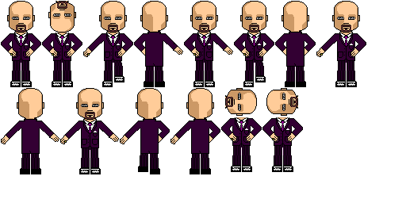

# Animations 动画

### Frame Animation 帧动画

用一系列图像文件可以创建一个动画，如下所示：

	CCAnimation *animation = CCAnimation::create();
	
	// load image file from local file system to CCSpriteFrame, then add into CCAnimation
	for (int i = 1; i < 15; i++)
	{
	    char szImageFileName[128] = {0};
	    sprintf(szImageFileName, "Images/grossini_dance_%02d.png", i);
	    animation->addSpriteFrameWithFileName(szImageFileName);  
	}
	
	animation->setDelayPerUnit(2.8f / 14.0f); // This animation contains 14 frames, will continuous 2.8 seconds.
	animation->setRestoreOriginalFrame(true); // Return to the 1st frame after the 14th frame is played. 
	
	CCAnimate *action = CCAnimate::create(animation);
	sprite->runAction(action);  // run action on sprite object

注意区别：“CCAnimation”由精灵帧、每帧延迟时间及持续时间等组成。因此相当于一个“数据”包。而“CCAnimate”是一个动作，是基于“CCAnimation”对象而创建的动作。

### 精灵表（Sprite Sheet）动画

尽管手工动画很好理解，但在实际游戏项目中很少使用手工的动画。相反，精灵表动画是2D动画的常用解决方案。

这是一个典型的精灵表。精灵表可以是一连串精灵帧组成的动画或者是在同一场景中的图片包。

在OpenGL ES 1.1阶段，精灵表广受使用优点如下：

1. 减少文件输入输出（file I/O）时间。载入大精灵表会比载入很多小文件更快。
2. 减少内存能耗。OpenGL ES 1.1只能使用二次幂限制（power-of-two）的纹理（即高度或宽度为2,4,8, 64,128,256,512,1024）。换句话说，OpenGL ES 1.1会为每个纹理分配二次幂的内存，即便是小于规定高度或宽度的纹理也是如此。所以使用打包的精灵表图像会减少内存的分块。
3. 减少对Open GL ES的绘制调用，加快渲染速度。

升级的Cocos2d-x v2.0基于OpenGL ES 2.0。OpenGL ES 2.0不会再给纹理分配二次幂内存块，但仍然会减少文件输入输出的次数，减少绘制调用。       

那动画呢？我们知道，精灵表与动画之间没有“MUST-BE”关系。但是考虑到以上优点，精灵表动画也是有效的。在cocos2d引擎中创建精灵表的方法有几种。

### 用.png及.plist文件创建

在Cocos2d-x 0.x及1.x版本中，“CCSpriteSheet”即用于创建精灵表。自2.0版本以来，我们就用“CCSpriteBatchNode”来替换“CCSpriteSheet”。           
“CCSpriteBatchNode”对象包括所有精灵帧的真实图像纹理。你必须将“CCSpriteBatchNode”添加到场景中，即便其本身不会画出任何东西；但必须作为渲染流水线的一部分存在。例如：

	CCSpriteBatchNode* spritebatch = CCSpriteBatchNode::create("animations/grossini.png");

然后，需要使用“CCSpriteFrameCache”单元素集来跟踪帧名（frame name）如何对应帧界（frame bound），即精灵表处于什么矩形区域内，例如：

	CCSpriteFrameCache* cache = CCSpriteFrameCache::sharedSpriteFrameCache();
	cache->addSpriteFramesWithFile("animations/grossini.plist");

精灵表及帧载入完成之后，精灵表便已被添加到场景之中。你可以通过“`createWithSpriteFrameName`”方法创建使用这些帧的精灵，并将其作为精灵表的一个子图。

	m_pSprite1 = CCSprite::createWithSpriteFrameName("grossini_dance_01.png");
	spritebatch->addChild(m_pSprite1);
	addChild(spritebatch);

`createWithSpriteFrameName` 方法会从“grossini.plist”列表中找到相应的坐标和矩形区域，然后将“grossini.png”纹理“剪辑”（clip）成一个精灵帧。
然后需要创建一个“CCArray”对象，并加入所有动画帧。该本动画中，可以看到14个帧大小都一样，所以可以使用嵌套循环（nested loop）来循环访问这些帧，当第14帧增加完成之后打断该循环。

	CCArray* animFrames = CCArray::createWithCapacity(15);
	
	char str[100] = {0};
	
	for(int i = 1; i < 15; i++) 
	{
	    sprintf(str, "grossini_dance_%02d.png", i);
	    CCSpriteFrame* frame = cache->spriteFrameByName( str );
	    animFrames->addObject(frame);
	}

最后需要创建一个“CCAnimate”动作实例，施加给“CCSprite”精灵。以下代码中，我们还将“CCAnimate”动作封装至“CCRepeatForever”动作中，“CCRepeatForever”会一直重复动作。如：

	CCAnimation* animation = CCAnimation::createWithSpriteFrames(animFrames, 0.3f);
	m_pSprite1->runAction( CCRepeatForever::create( CCAnimate::create(animation) ) );

### 文件动画

“CCAnimationCache”可以载入“xml”或“plist”文件，这种文件可以很好地描述批处理节点（batch node）、精灵帧名称及相应的矩形区域。界面也更易使用：

	CCAnimationCache *cache = CCAnimationCache::sharedAnimationCache(); // "caches" are always singletons in cocos2d
	cache->addAnimationsWithFile("animations/animations-2.plist");
	CCAnimation animation = cache->animationByName("dance_1");  // I apologize for this method name, it should be getAnimationByName(..) in future versions
	CCAnimate animate = CCAnimate::create(animation);  // Don't confused between CCAnimation and CCAnimate :)
	sprite->runAction(animate);

用起来很简单，对吧？

### 骨骼动画

请参考[骨骼动画](http://)页面。

