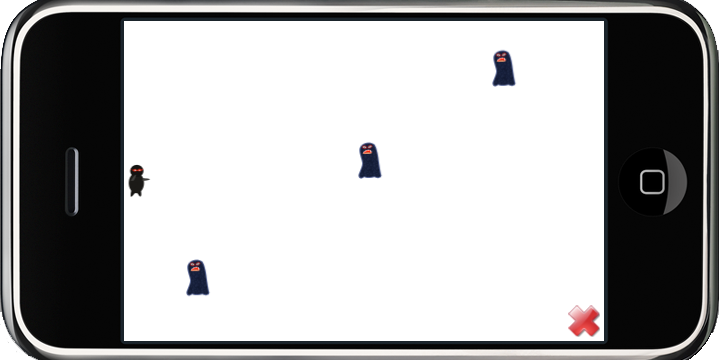
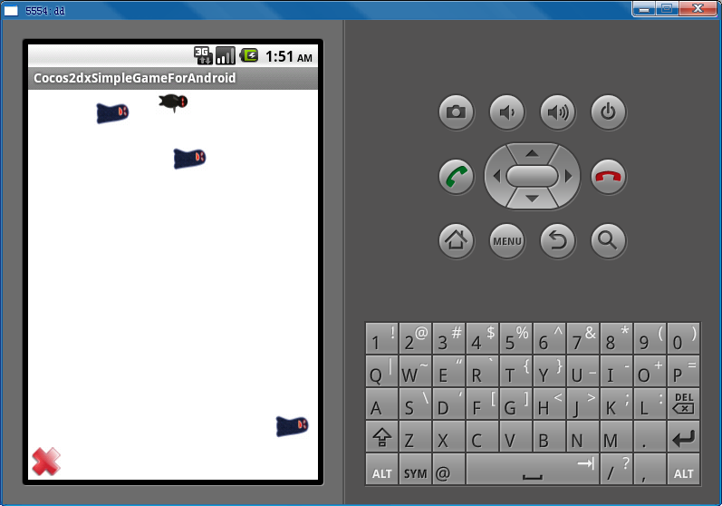
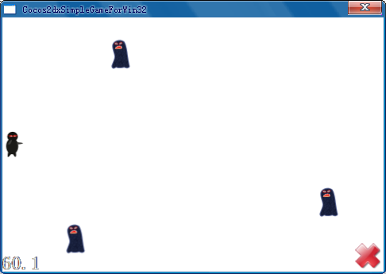

# 第三章——如何移动精灵（sprite）

第二章我们在场景中放了一个英雄。但是英雄太寂寞，我们再加些敌人来给他玩。
这时就要用到void addTarget()函数，这个函数会在场景中从右到左按照任意速度增加敌人。
在HelloWorldScene.h文件中对void addTarget()函数进行声明，然后在HelloWorldScene.cpp文件中增加以下代码（不要忘了在HelloWorldScene.cpp文件开头增加使用cocos2d命名空间）。

	// cpp with Cocos2d-x
	void HelloWorld::addTarget()	
	{	
		CCSprite *target = CCSprite::create(“Target.png”,	
		CCRectMake(0,0,27,) );	
		    // Determine where to spawn the target along the Y axis 	
		CCSize winSize = CCDirector::sharedDirector()->getWinSize();	
		int minY = target->getContentSize().height/2;	
		int maxY = winSize.height-target->getContentSize().height/2;	
		int rangeY = maxY – minY;	
	
		// srand( TimGetTicks() );	
		int actualY = ( rand() % rangeY ) + minY;	
		   // Create the target slightly off-screen along the right edge,	
		// and along a random position along the Y axis as calculated
		
		target->setPosition(	
			ccp(winSize.width + (target->getContentSize().width/2), 	actualY) );	
		this->addChild(target);
		
		 // Determine speed of the target	
		int minDuration = (int)2.0;	
		int maxDuration = (int)4.0;	
		int rangeDuration = maxDuration – minDuration;
		
		// srand( TimGetTicks() );	
		int actualDuration = ( rand() % rangeDuration ) + minDuration;	
		  // Create the actions	
		CCFiniteTimeAction* actionMove = CCMoveTo::create( (float)actualDuration,	
			ccp(0 – target->getContentSize().width/2, actualY) );	
		CCFiniteTimeAction* actionMoveDone = CCCallFuncN::create( this,callfuncN_selector	(HelloWorld::spriteMoveFinished));	
		target->runAction( CCSequence::create(actionMove,actionMoveDone, NULL) );	
	}

这里callfuncN_selector(HelloWorld::spriteMoveFinished)会回调spriteMoveFinished()函数，我们需要在HelloWorldScene.h文件中对该函数进行声明并作如下定义：

	// cpp with Cocos2d-x
	void HelloWorld::spriteMoveFinished(CCNode* sender)
	{
		CCSprite *sprite = (CCSprite *)sender;
		this->removeChild(sprite, true);
	}

提示：

1. 有关rand函数。Srand和rand是C语言的std函数。在每个平台上，你都可以利用sand获取毫秒级别的随即数字。iPhone平台中你可以通过直接使用函数来获取随即数字。
2. objc中的YES和NO对应cpp中的Ture和False。
3. objc中的回调函数是selector:@selector(spriteMoveFinished)，但是在cpp中执行有些复杂，可以参见“cocos2dx\include\selector_protocol.h”文件的声明部分。一共有5中不同的回调类型如下所示：   
	- 	schedule_selector
	- 	callfunc_selector
	- 	callfuncN_selector
	- 	callfuncND_selector
	- 	menu_selector

要根据不同的回调函数定义来使用这些回调函数。例如当使用函数CCTimer::initWithTarget时，第二个参数是SEL_SCHEDULE的类型，我们可以在selector_protocol.h文件中找到schedule_selector(_SELECTOR)的宏定义，然后声明回调函数void MyClass::MyCallbackFuncName(float)，然后将该函数转换为CCTimer::initWithTarget函数的第二个参数。
然后我们间隔性地放置一些敌人，在函数返回之前增加以下代码。

	// cpp with Cocos2d-x
	// Call game logic about every second
	this->schedule( schedule_selector(HelloWorld::gameLogic), 1.0 );

在HelloWorldScene.cpp文件中执行gameLogic()函数。注意：gameLogic()应该声明为公共类（public）。

	// cpp with Cocos2d-x
	void HelloWorld::gameLogic(float dt)
	{
	    this->addTarget();
	}

至此即可编译和运行。享受编译成功吧！    

IPhone界面    

          
Android 界面   

      
Win32界面    
 

