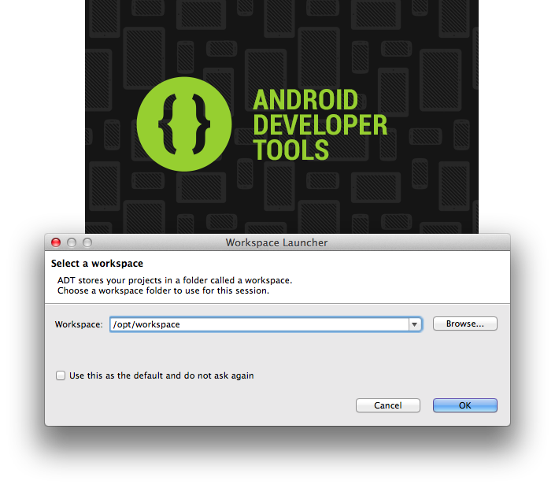
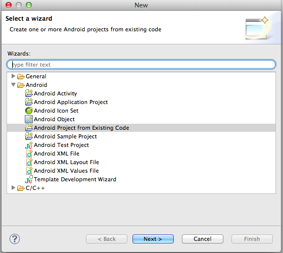
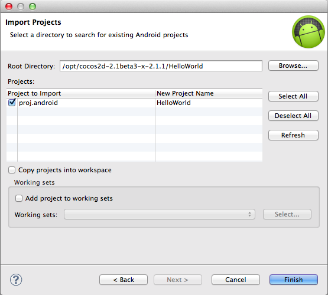
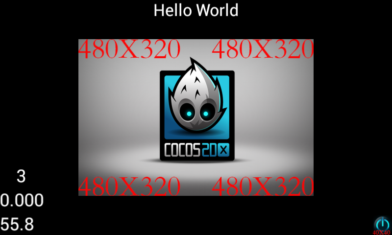

如何在Mac OS X上搭建Cocos2d-x安卓开发环境
================

## 版本 ##

- Cocos2d-x: cocos2d-2.1beta3-x-2.1.1
- OS X: 10.8
- Android ADT Bundle: v21.1.0
- Android NDK: android-ndk-r8d
- Device: Android 4.2.1

这次我们测试的设备安装的是Android4.2.1, Cocos2d-x能支持Android2.2以上版本.

文件路径:

- Cocos2d-x: /opt/cocos2d-2.1beta3-x-2.1.1
- Android ADT Bundle: /opt/adt-bundle-mac-x86_64
- Android NDK: /opt/android-ndk 下文中提及的这些路径, 请替换成您自己的路径

## 下载最新版本Cocos2d-x ##

您可以在Cocos2d-x官网找到下载页面
 解压后到您需要的位置, 本文假设解压到以下位置

	/opt/cocos2d-2.1beta3-x-2.1.1


## 检查JDK ##

在终端中输入

	sh java -version


如果您没有安装JDK, 系统会帮您自动安装JDK.


安装过后您会看到如下输出

	java version "1.6.0_37" Java(TM) SE Runtime Environment (build 1.6.0_37-b06-434-11M3909) Java HotSpot(TM) 64-Bit Server VM (build 20.12-b01-434, mixed mode)


## 下载最新版本Android ADT Bundle ##

Google将Android SDK, Eclipse, ADT(Android Developer Tools)打包在一起,称作Android ADT Bundle, 简化了Android开发环境的搭建.
您可以在Android官网找到下载页面
 解压到您需要的位置, 本文假设解压到以下位置

	/opt/adt-bundle-mac-x86_64


在终端中运行下面命令, 将ADT中的Eclipse放入您的程序文件夹, 方便启动

	sh ln -s /opt/adt-bundle-mac-x86_64/eclipse/Eclipse.app/ /Applications/Eclipse-ADT.app


在/Applications中或者Launchpad中找到并打开Eclipse-ADT



## Eclipse的Retina支持 ##

如果您在使用带Retina的Mackbook Pro, Eclipse暂时还不支持Retina. 但有一个简单的[解决方案](https://bugs.eclipse.org/bugs/show_bug.cgi?id=382972)

1. 在 /opt/adt-bundle-mac-x86_64/eclipse 找到 Eclipse.app
2. 编辑

	Contents/Info.plist

3. 找到:

4. 在其上面添加 

	NSHighResolutionCapable

5. 将Eclipse.app移动到新的文件夹, 然后再移动回来. (防止系统缓存了上面提及的Info.plist)
6. OK啦.

## Android SDK Manager ##

Android ADT Bundle中是包含了Android SDK Manager的. 启动您的Eclipse-ADT. 可以在工具栏中或者菜单中找到Android SDK Manager.


## Android NDK ##

您可以在Android官网找到Android的[下载页面](http://developer.android.com/tools/sdk/ndk/index.html)
下载后解压到您需要的位置, 本文假设解压到以下位置

	/opt/android-ndk


设置环境变量

我们需要将SDK, NDK以及Cocos2d-x的路径中添加到环境变量中. 将以下内容添加到~/.bash_profile文件

	export COCOS2DX_ROOT=/opt/cocos2d-2.1beta3-x-2.1.1 export ANDROID_SDK_ROOT=/opt/adt-bundle-mac-x86_64/sdk export ANDROID_NDK_ROOT=/opt/android-ndk export NDK_ROOT=/opt/android-ndk export PATH=$PATH:$ANDROID_NDK_ROOT export PATH=$PATH:$ANDROID_SDK_ROOT


## HelloWorld ##

万事俱备, 我们现在就可以开始激动人心的Cocos2d-x之旅了.
打开终端, 进入cocos2d-x所在目录并执行

	/opt/cocos2d-2.1beta3-x-2.1.1/create-android-project.sh


文件
 根据提示输入对应信息.

	``` Youngs-MacBook-Air:~ young40$ cd /opt/cocos2d-2.1beta3-x-2.1.1/ Youngs-MacBook-Air:cocos2d-2.1beta3-x-2.1.1 young40$ ./create-android-project.sh use global definition of NDK_ROOT: /opt/android-ndk use global definition of ANDROID_SDK_ROOT: /opt/adt-bundle-mac-x86_64/sdk Input package path. For example: org.cocos2dx.example com.young40.test //这里输入了包名 Now Cocos2d-x supports Android 2.2 or upper version


## Available Android targets: ##

	id: 1 or "android-17" Name: Android 4.2 Type: Platform API level: 17 Revision: 1 Skins: HVGA, QVGA, WQVGA400, WQVGA432, WSVGA, WVGA800 (default), WVGA854, WXGA720, WXGA800, WXGA800-7in ABIs : armeabi-v7a input target id: 1 //选择您需要的平台id input your project name: HelloWorld //输入项目名称 Created project directory: /opt/cocos2d-2.1beta3-x-2.1.1/HelloWorld/proj.android
	 
	......
	 
	Updated project.properties Updated local.properties Updated file /opt/cocos2d-2.1beta3-x-2.1.1/HelloWorld/proj.android/proguard-project.txt Youngs-MacBook-Air:cocos2d-2.1beta3-x-2.1.1 young40$


“ 从以上输出我们可以看到<
create-android-project.sh`这个脚本帮我们在 /opt/cocos2d-2.1beta3-x-2.1.1/HelloWorld 下建立了新项目.

然后我们可以先在终端中调用”build_native.sh”脚本编译该项目的C++部分.

	`` Youngs-MacBook-Air:~ young40$ cd /opt/cocos2d-2.1beta3-x-2.1.1/HelloWorld/proj.android/ Youngs-MacBook-Air:proj.android young40$ ./build_native.sh NDK_ROOT = /opt/android-ndk COCOS2DX_ROOT = /opt/cocos2d-2.1beta3-x-2.1.1/HelloWorld/proj.android/../.. APP_ROOT = /opt/cocos2d-2.1beta3-x-2.1.1/HelloWorld/proj.android/.. APP_ANDROID_ROOT = /opt/cocos2d-2.1beta3-x-2.1.1/HelloWorld/proj.android Using prebuilt externals make: Entering directory
	/opt/cocos2d-2.1beta3-x-2.1.1/HelloWorld/proj.android'
	 
	.....
	
	StaticLibrary : libchipmunk.a StaticLibrary : libextension.a SharedLibrary : libgame.so Install : libgame.so =&gt; libs/armeabi/libgame.so make: Leaving directory `/opt/cocos2d-2.1beta3-x-2.1.1/HelloWorld/proj.android' Youngs-MacBook-Air:proj.android young40$ ```


## 导入Eclipse-ADT ##

打开Eclipse-ADT, 点击快捷键

	command+N


打开新建项目窗口并选择

	Android Project from Existing pre






这时您可能会在eclipse的

	Problems


窗口看到如下错误

	The import org.cocos2dx.lib cannot be resolved HelloWorld.java /HelloWorld/src/com/young40/test line 26 Java Problem Cocos2dxActivity cannot be resolved to a type HelloWorld.java /HelloWorld/src/com/young40/test line 30 Java Problem Cocos2dxActivity cannot be resolved to a type HelloWorld.java /HelloWorld/src/com/young40/test line 33 Java Problem


您需要将

	/opt/cocos2d-2.1beta3-x-2.1.1/cocos2dx/platform/android/java


如上面处理一样也作为一个项目导入eclipse中
 然后在HelloWorld项目上点击右键选择刷新, 可以看到错误就消失了.

将您的手机设置成调试模式并用USB线连接到电脑, 在Eclipse中运行HelloWorld, 然后就能在手机上看到已经运行的HelloWorld了



好了, 享受您的奇妙的Cocos2d-x之旅吧!
