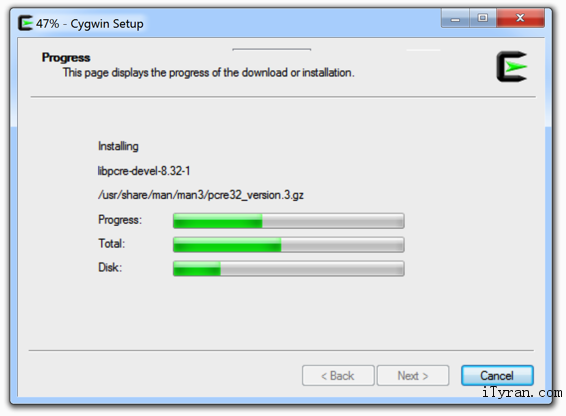
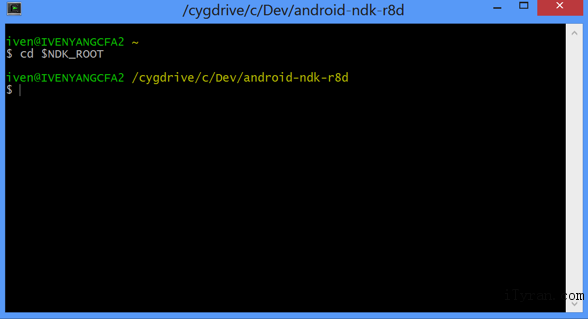
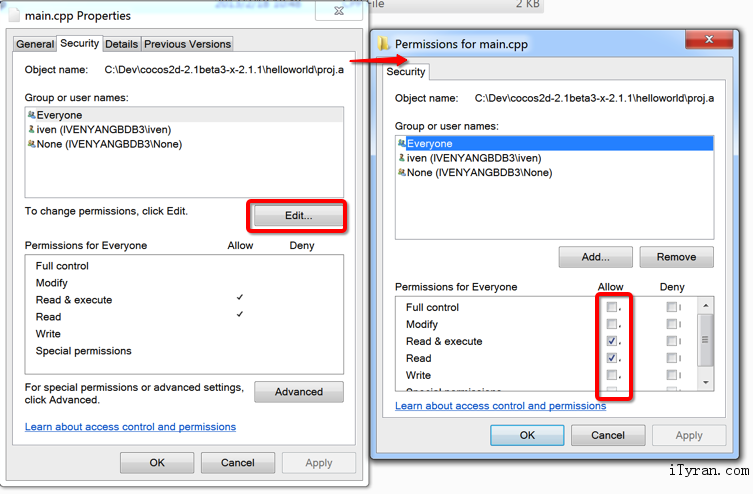
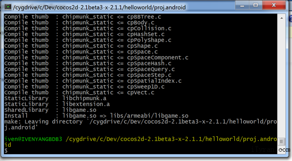

# 在Windows7上搭建Cocos2d-x安卓开发环境
---

在windows7上搭建Android的COCOS2D-X开发环境并不难， 但是由于框架更新过快，很多用户都有困难。我希望你们认为这个教程有用。

建议：为了避免安全相关的问题，请以管理员权限执行所有的操作，当运行命令的时候，也要确保之前是以管理员权限打开了命令行窗口.

## 下载SDK，NDK，以及COCOS2D-X

l  下载最新稳定版本的COCOS2D-X

到官方的COCOS2D-X网页获取ZIP文件， 并解压到安全的位置，你将会在后面的工作中经常用到这个位置。建议您使用c:\cocos2d-x\

l  下载并安装Android SDK.

包括核心ANDROID SDK组件和某个版本的内含ADT组件的ECLIPSE。

l  现在下载并安装JDK，本次安装的版本是jdk-7u13-window-x64.exe

l  下载并安装Cygwin

搜索如下的安装包，确保安装了这些软件.

autoconf, automake, binutils, gcc-core, gcc-g++, gcc4-core, gcc4-g++, gdb, pcre, pcre-devel, gawk, make

## 编辑脚本文件

根据你的环境编辑create-android-project.bat，如下所示:

	<code class="cpp"> set _CYGBIN=c:\cygwin\bin The path of cygwin bin set _ANDROIDTOOLS=C:\Dev\adt-bundle-windows-x86_64\sdk\tools The path of android sdk tools set _NDKROOT=C:\Dev\android-ndk-r8d The root of ndk </code>

注意：不要用notepad（记事本）修改脚本文件, 请使用诸如sublime， vim的文件编辑器，否则文字将不能正常换行， 很影响阅读和理解.

执行脚本

在windows文件浏览器中执行脚本。这个脚本会提示你选择工程路径，请按com.yourproject.something的格式设置好， 然后选择工程名字和target ID. 这样会在Cocos2d-x的安装目录中，建立一个以工程名命名的目录。执行脚本后， 您将会看到如下内容，没有任何错误。

搭建NDK_ROOT环境变量

在home\<yourname>\.bash_profile(本例中为c:\cygwin\home\Iven\.bash_profile)的末尾加入如下的环境变量

	<code class="cpp"> NDK_ROOT=/cygdrive// export NDK_ROOT </code>

示例：

	<code class="cpp"> NDK_ROOT=/cygdrive/C/Dev/android-ndk-r8d export NDK_ROOT </code>

重启cygwin， 输入 cd $NDK_ROOT, 你将看到如下信息：

 

## 运行build_native.sh

现在来运行自动生成的Yourgame/proj.android路径下的build_native.sh（本例中为c:\Dev\cocos2d-2.1beta3-x-2.1.1\helloworld\proj.android\build_native.sh）.首先要打开Cygwin的终端，然后确保执行cd cygdrive， 然后导航到你工程中的android文件夹，就可以执行这个脚本了。

注意： 如果你使用的是NTFS分区格式，可能看到如下的标准错误输出：

	<code class="cpp"> c:/android-ndk-r8d/toolchains/arm-linux-androideabi-4.6/prebuilt/windows/bin/../ lib/gcc/arm-linux-androideabi/4.6/../../../../arm-linux-androideabi/bin/ld.exe: ./obj/local/armeabi/libextension.a(HttpClient.o): in function cocos2d::extension ::processGetTask(cocos2d::extension::CCHttpRequest*, unsigned int ()(void, uns igned int, unsigned int, void*), void*, int*):D:/cocos2d-2.1beta3-x-2.1.1/lolwut /proj.android/../../extensions/network/HttpClient.cpp:301: error: undefined refe rence to 'curl_easy_getinfo' c:/android-ndk-r8d/toolchains/arm-linux-androideabi-4.6/prebuilt/windows/bin/../ lib/gcc/arm-linux-androideabi/4.6/../../../../arm-linux-androideabi/bin/ld.exe: ./obj/local/armeabi/libextension.a(HttpClient.o): in function cocos2d::extension ::processGetTask(cocos2d::extension::CCHttpRequest*, unsigned int ()(void, uns igned int, unsigned int, void*), void*, int*):D:/cocos2d-2.1beta3-x-2.1.1/lolwut /proj.android/../../extensions/network/HttpClient.cpp:309: error: undefined refe rence to 'curl_easy_cleanup' collect2: ld returned 1 exit status /cygdrive/c/android-ndk-r8d/build/core/build-binary.mk:397: recipe for target `o bj/local/armeabi/libgame.so' failed make: *** [obj/local/armeabi/libgame.so] Error 1 make: Leaving directory `/cygdrive/c/Dev/cocos2d-2.1beta3-x-2.1.1/helloworld/ proj.android' </code>

 

在cygwin中，自行修改Cocos2d-x和NDK的权限，就可以解决这个问题。

比如:
1.<code class="cpp"> chmod -R 775 Cocos2d-2.1beta3-x-2.1.1 chmod -R 775 android-ndk-r8d </code>

如果Cygwin显示权限失败，那么需要按照如下方法修改  helloworld\proj.android\jnk\hellocpp的属性

你会得到如下的输出.

 

## 在Eclipse中导入工程

马上就要完成了！现在我们来向Eclipse导入工程。打开Eclipse，选择“新建工程->从已存在的工程导入”（“create new project->import from existing project”）

重要提示 ：不要启用“把工程拷贝到工作目录”（copy projects into workspace），并且根目录必须要在Cocos2d-x的安装目录下.

创建工程后，你可能会碰到很多关于很多函数前有关键字@override的问题。 要解决这个问题，右键单机Eclipse中的工程->属性->Java编译器, 然后确保编译器compliance设置为1.6

## 编译运行

现在可以庆祝一下了。选择工程->编译, 然后选择 运行为->Android应用程序

 
