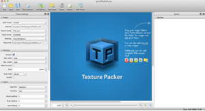
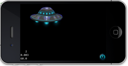

##TexturePacker

使用纹理打包器（Texture Packer）在Cocos2D-X引擎中创建精灵表。

本文介绍一种将精灵表融合到Cocos2D-X游戏项目的简易方法。

欲了解有关这方面更多信息，请参考Ray Wenderlich博客中的指南（http://www.raywenderlich.com/2361/how-to-create-and-optimize-sprite-sheets-in-cocos2d-with-texture-packer-and-pixel-formats）。该博客针对iPhone平台的Cocos2D引擎，但对于Cocos2D-X也同样有效。阅读本指南后，建议用户再去阅读上述博客中的指南，以了解更多有关如何Cocos2D如何处理像素格式的重要细节内容。

现在正式进入主题。首先推荐使用纹理打包器创建精灵表。纹理打包器并不是免费程序，但是有一个Demo版本用起来很不错，全功能版本目前价格大约为20欧元。所以也花不了很多前，纹理打包器用处很大，列出一些优点如下：

- 简单易用，可以在几秒钟的时间内创建精灵表。不用费时去处理纹理位置问题。
- 优化游戏：该应用会自动创建两种纹理，使用所有的变量空间，这意味着你可以在更小的纹理中存放更多的资产。
- 几乎兼容任何游戏引擎包括Cocos2D、Cocos2D-X、Lib-GDX、 AndEngine、Unity3D 、just JSON及plain XML等等

附：我没有在做广告~

现在假设用户已经下载纹理打包器。打开纹理打包器，将资产拖入精灵窗口中，如下图所示：



你会看到纹理打包器创建纹理，该纹理由所有独立的精灵组成。漂亮！现在确保选择cocos2d作为DataFormat（数据格式）。至于数据文件（Data file），选择一个目标文件夹然后在文件名称后加上“plist”。这种文件会包含精灵表（即每个精灵在纹理中所处的位置）的元数据（metadata）。

选择PVR作为纹理格式、选择RGB8888作为图像格式。你可能还会用例如RGBA4444作为图像格式，这种格式会减小每像素字节的数量，从而（大幅）减少最终纹理的大小，这样做很好，对于要求更不详细的纹理而言，质量上可以接受，例如用作地图。

在纹理文件中输入PVR文件。准备好后便点击顶部的“Publich”按钮，程序便会生成两个文件。

现在已经备好了Xcode项目所需的文件！打开Xcode然后将文件拖入资源文件夹中。本机文件名分别为“gamePlayPack.pvr”和“gamePlayPack.plist”。

这就是用于绘制纹理中资产的必要代码。

```
_batchNode = CCSpriteBatchNode::batchNodeWithFile("gamePlayPack.pvr");

this->addChild(_batchNode);

CCSpriteFrameCache::sharedSpriteFrameCache()->addSpriteFramesWithFile("gamePlayPack.plist");

_ship = CCSprite::spriteWithSpriteFrameName("ufo.png");
CCSize winSize = CCDirector::sharedDirector()->getWinSize();
_ship->setPosition(ccp(winSize.width * 0.1, winSize.height * 0.5));
_batchNode->addChild(_ship, 1);
```

这里载入“PVR”和“PLIST”文件，然后用“spriteWithSpriteFrameName”函数初始化精灵，这基本会要求单独图片的原始文件名引用我们的资产，本机为“ufo.png”。

记住“plist”文件包括已知原始资产之间的关系以及“PVR”纹理中的集合资产。

以上即为纹理打包器的用法！欲了解更多指南信息请参考http://www.jesusbosch.com。

