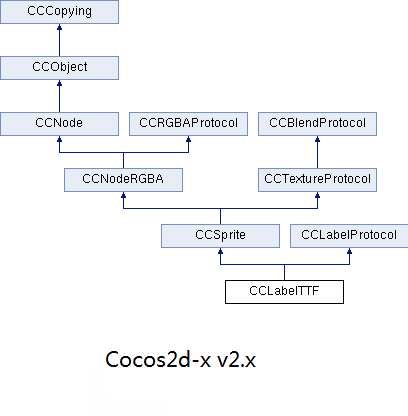
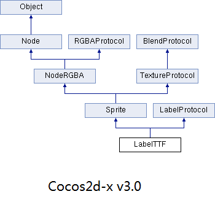

# Cocos2d-x 3.0对Label的改进

-------------

在Cocos2d-x3.0之前的版本中，可以向场层和精灵上添加文字的类有三个：CCLabelTTF、CCLabelBMFont和CCLabelAtlas。

3.0版本对文本显示这一块有所改进的是，新增Label类中有四个可添加文字的类：Label、LabelTTF、LabelBMFont和LabelAtlas。其中LabelTTF、LabelBMFont和LabelAtlas在功能上承续之前的版本，只是在命名方式等有所调整。

Label类可以代替LabelTTF和LabelBMFont类，它使用freetype库进行字体绘制，可以做到各平台相同的文本效果，同时使用了更快的缓存策略，效率更高，提供了追踪(tracing)、阴影和更多的功能。

变化：

1. 去掉了类、结构体和宏的CC前缀和一些其他类似匈牙利命名方式的前缀，例如m、p等等；
2. 改变了成员函数中某些参数和返回值的数据类型，比如char换成了string、unsigned int换成了long等等；
3. 改变了某些枚举类型的名字和属性值；
4. 将引擎中不会被修改数据成员的函数都声明成了const 类型，提高了程序的健壮性。

## 主要调整
### 从继承关系图上比较
从继承关系上比较，v3.0版本的类都去掉了CC前缀，也去掉了CCCopying基类。例如：

#### CCLabelTTF类和LabelTTF类的比较

### 水平对齐方式和垂直对齐方式定义有所变化

#### V2.x的版本

	static CCLabelTTF * create(const char *string, const char *fontName, float fontSize,
	　　                               const CCSize& dimensions, CCTextAlignment hAlignment, 
	　　                               CCVerticalTextAlignment vAlignment);

#### v3.0版本

	static LabelTTF * create(const std::string& string, const std::string& fontName, float fontSize,
	　　                             const Size& dimensions, TextHAlignment hAlignment,
	　　                             TextVAlignment vAlignment);

从上面例举的函数中可以看到升级后的多个改变，首先，去掉了CC前缀；其次，参数中char都被换成了string类型，用起来更加方便（string相对高级一点，用起来比较方便，容易处理，char的话操作稍微麻烦些，但是效率比较高）；
另外，函数后两个参数（文本的水平对齐方式和垂直对齐方式）的类型也改变了，但它们要表达的意思和功效和以前的版本是一样的，只是名字变了而已,改变如下：

| |*cocos2d-x-2.x*|*cocos2d-x-3.0*|
|---------------|---------------|---------------|
|水平文本对齐方式|typedef `enum{kCCTextAlignmentLeft,kCCTextAlignmentCenter,kCCTextAlignmentRight,} CCTextAlignment;`|`enum class TextHAlignment{LEFT,CENTER,RIGHT};`|
|垂直文本对齐方式|`typedef enum{kCCVerticalTextAlignmentTop, kCCVerticalTextAlignmentCenter,kCCVerticalTextAlignmentBottom,} CCVerticalTextAlignment;`|`enum class TextVAlignment{TOP,CENTER,BOTTOM};`|

## 不同的改变

LabelBMFont类除了和上面类似的变化外，在LabelBMFont中还去掉了函数：

	CCBMFontConfiguration* getConfiguration() const;

所以v3.0中不能再调用该函数得到LabelBMFont类的_configuration（.fnt文件的配置属性）了。

## 扩展
### 新增Label类

先来看看Label类的继承关系图表：   

图中LabelTextFormatProtocol也是新增类，它同LabelProtocol一样，都是纯虚类，做为存储字符串的接口使用。它的继承关系图谱如下：

-----------------------------

在Label中的两个静态公共成员函数:

	static Label* createWithTTF(const std::string& label, const std::string& fontFilePath, int fontSize, int lineSize = 0, TextHAlignment alignment = TextHAlignment::CENTER, GlyphCollection glyphs = GlyphCollection::NEHE, const char *customGlyphs = 0);    
	static Label* createWithBMFont(const std::string& label, const std::string& bmfontFilePath, TextHAlignment alignment = TextHAlignment::CENTER, int lineSize = 0);

* createWithTTF()可以直接通过.ttf文件（TTF是TrueTypeFont的缩写，它是一种字库名称，是Apple公司和Microsoft公司共同推出的字体文件格式，随着windows的流行，已经变成最常用的一种字体文件表示方式）来创建Label。 

对Cocos2d-x有一定了解的人应该已经看出，这个函数与LabelTTF类（以前的CCLabelTTF类）创建label的方式是类似的，只不过LabelTTF类是通过字体名来创建label，而Label类是直接通过.ttf文件来创建。下面看一段代码，
分别是通过LabelTTF和Label来创建label:

	auto label1 = LabelTTF::create("Creating label through LabelTTF class by file name", "myFontName", 24);
	label1->setPosition(Point(origin.x, origin.y + visibleSize.height - label1->getContentSize().height));
	label1->setAnchorPoint(Point(0.0f, 0.0f));
    this->addChild(label1);

	auto label2 = Label::createWithTTF("Create label through Label class by .ttf file","fonts/myFontName.ttf", 32);
	label2->setPosition(Point(origin.x, origin.y + visibleSize.height - 80));
	label2->setAlignment(TextHAlignment::LEFT);
	label2->setAnchorPoint(Point(0.0f, 0.0f));
	this->addChild(label2);

运行程序可以看到：

LabelTTF这个类使用的是系统中的字体，如上图所示。

	label2->setAlignment(TextHAlignment::LEFT)；//设置文本水平对齐方式为向左对齐

* createWithBMFont()可以通过.fnt文件创建Label，同样这个函数与LabelBMFont类创建label的方式也有同样的的功效，下面看一段代码，分别通过LabelBMFont和Label来创建BMFont label:

	auto label3 = LabelBMFont::create("Create label through LabelBMFont class by .fnt file", "fonts/helvetica-32.fnt");
	label3->setAnchorPoint(Point(0.0f, 0.0f));
	label3->setPosition(Point(origin.x, origin.y + visibleSize.height - 120));
	addChild(label3);

	auto label4 = Label::createWithBMFont("Create label through Label class by .fnt file", "fonts/konqa32.fnt");
	label4->setAnchorPoint(Point(0.0f, 0.0f));
	label4->setPosition(Point(origin.x, origin.y + visibleSize.height - 160));
	addChild(label4 );

运行程序可以看到

LabelBMFont这个类在使用之前，需要添加好字体文件，包括一个图片文件(**.png) 和一个字体描述文件（**.fnt），Label类调用createWithBMFont函数创建label时同样需要这两个文件。
fnt文件中包含了对应图片的名字(图片包含了所有你要绘制的字符)、图片中的字符对应的unicode编码、字符在图片中的坐标、宽和高等。

下面利用上面新建的label4来调用Label的成员函数，看看它的一些成员函数。

	auto size = label4->getLabelContentSize();//得到Label的容量尺寸
	CCLOG("Label content size: %.2fx%.2f", size.width, size.height);
	auto lineWidth = label4->getMaxLineWidth();
	CCLOG("lineWidth: %.2f", lineWidth);
	auto s = label4->getStringLenght();
	CCLOG("string lenght:%.2f", s);
	label4->setScale(2.0f);	//设置缩放比例
	label4->setColor(Color3B::GREEN);				//设置label4的文字颜色
	label4->setOpacity(127);						//设置label4的文字不透明度
	auto CChar = (Sprite*)label4->getLetter(0);		//得到label的第一个字符
	auto jump = JumpBy::create(0.5f, Point::ZERO, 60, 1);
	auto jump_4ever = RepeatForever::create(jump);
	CChar->runAction(jump_4ever);

	schedule(schedule_selector(HelloWorld::step), 0.1f);

运行程序可以看到

